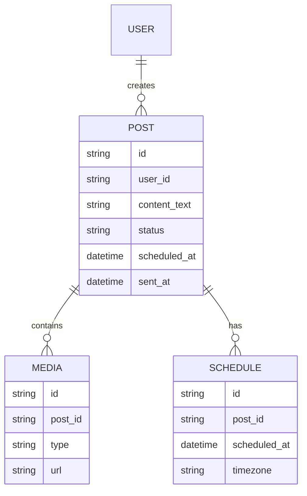

# Feature Specification: X Post Creator & Scheduler (MVP)

**Feature Branch**: `001-x-post-creator`  
**Created**: 2025-11-04  
**Status**: Draft  
**Input**: Tech-free feature description provided by product owner.

## Summary

A web application that enables an X user to rapidly generate, preview, organize, edit, schedule,
and auto-post engaging posts created with an LLM. The MVP focuses on a single-account flow and
streamlines the end-to-end process so a user can create and schedule a post in under 60 seconds
and reduce creation time from ~30 minutes to <3 minutes.

The system provides editable preview tiles, drag-and-drop organization, exact release time
scheduling, background auto-posting with retries, and a full history with explicit status tracking
(Draft → Scheduled → Sent → Failed).

## User Scenarios & Testing _(mandatory)_

### User Story 1 - Generate post with LLM (Priority: P1)

Gherkin:

Given a logged-in X user
When they request a generated post by providing a prompt or selecting a template
Then the system returns a draft post text within 10 seconds and displays it in an editable tile

Acceptance Criteria:

- A draft post is created and shown in a tile view within 10 seconds of request in 95% of attempts.
- The tile is editable immediately and changes are persisted locally (client-side) until saved.
- If LLM generation fails or times out, the system displays a clear error and a retry option.

### User Story 2 - Preview and edit tile (Priority: P1)

Gherkin:

Given a user has a draft post tile
When they open the tile editor or edit inline
Then they can modify the post text and save changes, and the tile updates accordingly

Acceptance Criteria:

- Inline edit or open-editor workflow updates the tile content on save.
- Character count is visible and status indicates whether the post fits platform limits (informational,
  not enforced in MVP unless the platform rejects the post).
- Edits must be undoable (single-level undo within the tile) and changes persisted to the draft state.

### User Story 3 - Generate or attach media (Priority: P2)

Gherkin:

Given a user is editing a post tile
When they request an image via LLM-image generation or attach an image
Then the image is associated with the tile and visible in the preview

Acceptance Criteria:

- The system can attach a generated or uploaded image to a draft tile and render a thumbnail in the
  tile preview.
- Image generation must complete within a reasonable timeout (configurable; recommended 30s); if it
  fails the UI shows an error and allows upload instead.
- Uploaded images are validated for allowed size and type; invalid images show a helpful error.

### User Story 4 - Arrange tiles (Priority: P2)

Gherkin:

Given multiple draft tiles exist on the canvas
When the user drags a tile to reorder or groups tiles
Then the new order/grouping is saved and reflects the intended post sequence

Acceptance Criteria:

- Drag-and-drop reordering updates the in-memory order and persists the order to the server when the
  user saves or explicitly commits the layout.
- Reordering must be intuitive on desktop; keyboard-accessible reordering is documented as a
  keyboard shortcoming for the MVP but should not block delivery.
- Grouped tiles (optional grouping feature) allow batch scheduling (if batch scheduling is out of scope,
  grouping is purely organizational in MVP and persists client/server-side).

### User Story 5 - Schedule exact release time (Priority: P1)

Gherkin:

Given a draft or edited post tile
When the user selects a date & time and confirms schedule
Then the system sets the post to Scheduled and will attempt to post at the exact time

Acceptance Criteria:

- The date/time picker accepts timezone-aware date and time and persists the scheduled UTC timestamp.
- Scheduled posts show as "Scheduled" in the UI with the exact scheduled time.
- If scheduling a post in the past, the system prevents it and suggests the next available timeslot.

### User Story 6 - Auto-post at scheduled time (Priority: P1)

Gherkin:

Given a post is in Scheduled state with a target UTC timestamp
When the scheduled time arrives
Then the background system attempts to post to X API and updates the post status to Sent or Failed

Acceptance Criteria:

- The system attempts to post within ±1 minute of the scheduled time; success or failure recorded.
- On success, status becomes Sent and the post record stores the remote post ID and timestamp.
- On failure, status becomes Failed with an error code and human-readable message; the system
  enqueues retries according to the retry policy.

### User Story 7 - Retry on failure (Priority: P1)

Gherkin:

Given a post attempt has Failed
When retry policy triggers or user requests retry
Then the system re-attempts posting and updates status accordingly

Acceptance Criteria:

- Retry policy: exponential backoff with configurable attempts (MVP default: 3 attempts at 1m, 5m, 15m).
- If all retries fail, the status remains Failed and the UI surfaces details and a manual retry button.
- Rate-limit and transient error handling must respect platform policies and avoid rapid retries that
  could violate X API rules.

### User Story 8 - View history and statuses (Priority: P1)

Gherkin:

Given a user opens the history view
When they inspect past posts
Then they can see each post with its status (Draft, Scheduled, Sent, Failed) and details

Acceptance Criteria:

- The history lists posts with timestamps, status, scheduled time (if any), and remote post ID for Sent
  items.
- The UI must allow filtering by status and sorting by date.
- Failed items must surface error details and links to retry or inspect logs where appropriate.

## Edge Cases

- Network offline while scheduling or saving: drafts must persist locally and synchronize when online.
- LLM rate limits or quota exhaustion: present clear messages and degrade gracefully to manual input.
- Platform rate limiting: if posting is rate-limited, respect Retry policy and platform rate limits; do not
  retry in a tight loop.

## Requirements _(mandatory)_

### Functional Requirements

- **FR-001**: System MUST allow an authenticated user to request LLM-generated post text. The result
  MUST be returned as a draft within 10s (95th percentile) or provide clear retry/error UI.
- **FR-002**: System MUST display generated drafts as editable tiles with inline editing and single-level
  undo.
- **FR-003**: System MUST support attaching/generated images to drafts and show previews.
- **FR-004**: System MUST allow drag-and-drop reordering of tiles and persist order.
- **FR-005**: System MUST allow the user to schedule an exact release time (timezone-aware) and persist
  scheduled UTC timestamp.
- **FR-006**: System MUST attempt to post at the scheduled time and update status to Sent or Failed.
- **FR-007**: System MUST implement a retry policy for failed posts with exponential backoff (MVP default
  attempts: 3).
- **FR-008**: System MUST record and display a history of posts with statuses and timestamps.
- **FR-009**: System MUST surface clear error messages for failures (LLM, network, post errors) and provide
  actionable user options (retry, edit, reschedule).
- **FR-010**: System MUST log posting attempts and results (including remote post IDs) for auditability.

### Non-Functional Requirements

- **NFR-001 (Performance)**: LLM generation latency target: <=10s (95th percentile) per success metric.
- **NFR-002 (Reliability)**: Posting attempts MUST achieve 100% on-time posting within ±1 minute; system
  must surface discrepancies and audit logs when missed (operational goal).
- **NFR-003 (Security/Compliance)**: All actions that post on behalf of a user MUST be authorized via
  OAuth (explicit consent flows) and respect platform rate limits and policies.
- **NFR-004 (Usability)**: 90% users should be able to schedule a post in under 60s (measured via
  usability testing).
- **NFR-005 (Observability)**: System must emit events for generation requests, scheduling actions,
  posting attempts, retries, and final outcomes; logs should be queryable for debugging and audits.

## Key Entities _(include if feature involves data)_

- **Post**

  - id (internal)
  - user_id
  - content_text
  - content_html_preview
  - created_at
  - updated_at
  - status (draft|scheduled|sent|failed)
  - scheduled_at (nullable, UTC)
  - sent_at (nullable, UTC)
  - remote_post_id (nullable)
  - error_code (nullable)
  - error_message (nullable)

- **Media**

  - id
  - post_id
  - type (image|video|other)
  - url or storage reference
  - alt_text
  - width/height
  - created_at

- **Schedule** (logical object; in MVP schedule fields kept on Post but separate schedule table optional)

  - id
  - post_id
  - scheduled_at (UTC)
  - timezone
  - created_by
  - created_at

- **Status** (enumeration)
  - DRAFT, SCHEDULED, SENT, FAILED

## Mermaid ERD

## Success Criteria _(mandatory)_

- **SC-001**: LLM generates a draft post in <10s for 95% of generation requests (measured in staging).
- **SC-002**: 90% of test users can schedule a post in <60s during usability tests.
- **SC-003**: Scheduled posts are attempted within ±1 minute of scheduled time for 100% of scheduled items.
- **SC-004**: No X API policy violations observed in integration tests and staging (automated checks + manual review).
- **SC-005**: Users can view post history with correct statuses and remote IDs for Sent items.

## Assumptions

- Single X account per user in MVP (no multi-account support).
- OAuth token refresh and secure secret storage are handled by platform best practices (implementation detail).
- LLM and image generation providers provide an API with reasonable latency; retries/backoff for provider
  transient failures will be implemented.
- Background posting worker has reliable scheduling infrastructure (cron/queue) but exact implementation
  is out of scope (tech detail).

## Out of Scope

- Multi-account posting
- Analytics and deep metrics dashboards
- Native mobile app (mobile web only in scope)

## Open Questions / [NEEDS CLARIFICATION]

1. [NEEDS CLARIFICATION: Retry policy configuration scope]
   - Context: MVP defines default retry attempts (3) and backoffs (1m, 5m, 15m). Clarify whether users need
     UI controls to override retry attempts or this remains a server-side operational config.

(Max 1 clarification used — more can be added if you deem critical.)

**RESOLVED (2025-11-04):**  
 Retry policy is **server-side operational config only** in MVP.

- Default: 3 attempts (1m, 5m, 15m)
- No UI exposure
- Future phase: Add override in Settings (Phase 2)
- Rationale: YAGNI + prevents abuse (rate limit bans)

## Next Steps

1. Review and confirm [NEEDS CLARIFICATION] above.
2. Convert this spec into an implementation plan (task breakdown, infra needs, ADRs).
3. Prepare acceptance tests and test harness for timing/latency metrics.
